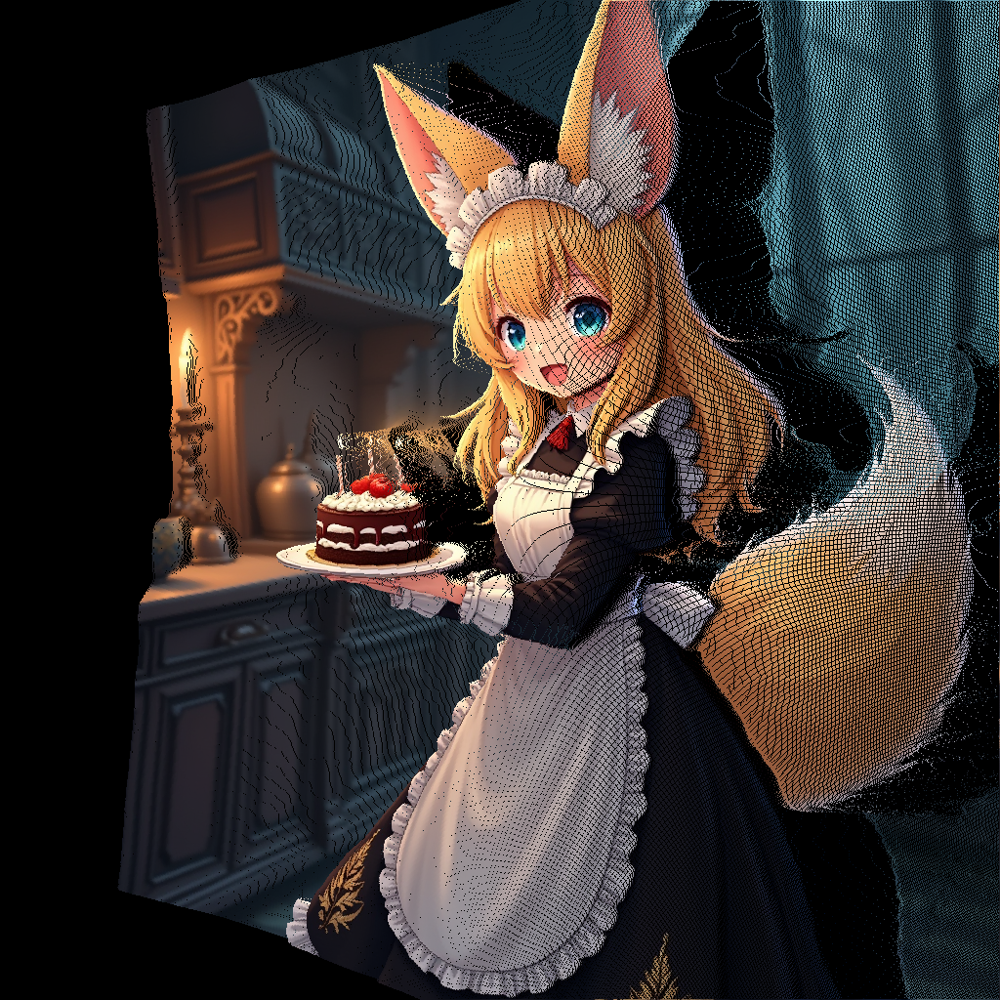

# camera-comfyUI

## Overview
This repository contains custom nodes for ComfyUI, designed to handle various projection models, camera movements, and point cloud manipulations. These nodes can be used to enhance workflows, create dynamic visual outputs, and perform continuous reprojection tasks.

## Features
- **Reprojection Nodes**: Enable continuous reprojection between different camera models and projections.
- **Point Cloud Nodes**: Work with point clouds, including depth-to-point cloud conversion, transformations, and rendering.
- Support for multiple projection models: Pinhole, Fisheye, and Equirectangular.
- Customizable camera movement and transformation nodes.
- Example workflows to demonstrate functionality.

## Installation
1. Clone this repository directly into the `custom_nodes` folder of your ComfyUI installation directory:
   ```bash
   git clone https://github.com/your-repo/camera-comfyUI.git custom_nodes/camera
   ```

## Node Categories

### Reprojection Nodes
These nodes allow for continuous reprojection between different camera models and projections. They include:
- **ReprojectImage**: Reprojects an image from one projection type to another.
- **TransformToMatrix**: Converts translation and rotation parameters into a 4x4 transformation matrix.
- **TransformToMatrixManual**: Allows manual input of a 4x4 transformation matrix.

### Point Cloud Nodes
These nodes enable working with point clouds and depth maps. They include:
- **DepthToPointCloud**: Converts a depth map and optional RGB(A) image into a point cloud.
- **TransformPointCloud**: Applies a 4x4 transformation matrix to a point cloud.
- **ProjectPointCloud**: Projects a point cloud back into an image and mask using z-buffering.

## Usage
1. **Reprojection Nodes**:
   - Use the `ReprojectImage` node to reproject images between different camera models and projections.
   - Use the `TransformToMatrix` or `TransformToMatrixManual` nodes to create transformation matrices for reprojection.
  

2. **Point Cloud Nodes**:
   - Use the `DepthToPointCloud` node to convert depth maps into point clouds.
   - Apply transformations to point clouds using the `TransformPointCloud` node.
   - Render point clouds back into images using the `ProjectPointCloud` node.
  
 - Outpainting reprojection for both piintcloud and grid_sampled nodes may be done by standard built-in inpaint/outpaint workflow or using the [ComfyUI-Flux-Inpainting](https://github.com/rubi-du/ComfyUI-Flux-Inpainting) for better results.

## Example Workflows
Example workflows are provided in the `workflows/` folder to help you get started:

### `demo_camera_workflow.json`
Demonstrates camera movement and reprojection. This workflow showcases how to outpaint an image in both pinhole and fisheye projections while rotating the camera. Example image pairs:

- **Initial Image - Pinhole Rotated**:
<div style="display: flex;">
  
  
</div>

- **Initial Image - Inpainted Fisheye**:
<div style="display: flex;">
  
  
</div>

- **Initial Image - Pointcloud Moved**:
<div style="display: flex;">
  
  
</div>

- **Initial Image - Pointcloud Fisheye Inpainted**:
<div style="display: flex;">
  
  
</div>

### `outpainting_fisheye.json` and `outpainting_fisheye_kitchen.json`
Showcases fisheye outpainting workflows. Example images:
<div style="display: flex;">
  
  
</div>

### `PointCloud.json`
Demonstrates point cloud manipulation and rendering. If depth is used, it is possible to move the camera freely and generate unpainted and outpainted images via point cloud.

### `Test pointcloud_loading.json`
This workflow demonstrates rendering camera movement from a point cloud. It showcases how to interpolate camera positions and generate dynamic visualizations. Example animation:

<div style="display: flex;">
  
</div>

The whole workflow for view synthesis is combination of `pointcloud_inpaint.json` and `Pointcloud_enricher.json` . 

## Additional Requirements
Some workflows require additional nodes from the following repositories:
- [ComfyUI-DepthAnythingV2](https://github.com/kijai/ComfyUI-DepthAnythingV2)
- [ComfyUI-Flux-Inpainting](https://github.com/rubi-du/ComfyUI-Flux-Inpainting)
- [ComfyUI-Image-Filters](https://github.com/spacepxl/ComfyUI-Image-Filters) (for CV and morphology operations)


## Contributing
Feel free to submit issues or pull requests to improve this repository. Contributions are welcome!

## TODO List
- [ ] Add processing to pointcloud or depthmap to remove outlier and lonely points at depth borders.
- [x] Use built-in comfyUI mask type an image.
- [x] Unite nodes into groups to simplify workflows.
- [ ] Create a single workflow for view synthesis.
- [x] Implement easier and more flexible camera control - more complex camera movements with more than 2 points.
- [ ] Add more examples and documentation for each node.
- [x] Add pointcloud union