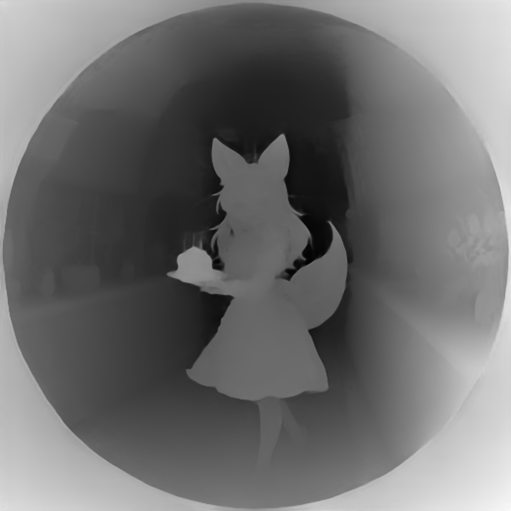

# camera-comfyUI
[](https://deepwiki.com/Alexankharin/camera-comfyUI)


> Custom ComfyUI nodes for advanced reprojections, point cloud processing, and camera-driven workflows.

---

## Table of Contents

* [Overview](#overview)
* [Features](#features)
* [Installation](#installation)
* [Node Categories](#node-categories)
* [Node Reference](#node-reference)
* [Workflows](#workflows)
* [Example Workflows](#example-workflows)
* [Contributing](#contributing)
* [TODO List](#todo-list)

---

## Overview

A collection of ComfyUI custom nodes to handle diverse camera projections (pinhole, fisheye, equirectangular), depth‐to‐point cloud conversions, dynamic reprojections, and inpainting/outpainting pipelines. Use these nodes to craft complex VR and 3D‐aware image transformations with minimal setup.

## Features

* ⚡ **Continuous Reprojection**: Transform images and depth maps between projection models.
* 🌐 **Point Cloud Pipelines**: Convert depth to 3D, clean, transform, and reproject point clouds.
* 🎥 **Camera Motion & Outpainting**: Animate camera trajectories, perform text‐guided outpainting in arbitrary views.
* 📦 **Modular Nodes**: Groupable ComfyUI nodes for flexible graph composition.
* 🛠️ **Example Workflows**: Ready‐to‐use JSON workflows demonstrating reprojection, inpainting, and view synthesis.

## Installation

1. **Clone** into your ComfyUI custom nodes folder:

   ```bash
   git clone https://github.com/Alexankharin/camera-comfyUI.git custom_nodes/camera-comfyUI
   ```

2. **System Dependencies (Ubuntu)**:

   ```bash
   sudo apt-get update && sudo apt-get install build-essential ffmpeg libsm6 libxext6 -y
   ```

3. **Python Requirements**:

   ```bash
   pip install -r custom_nodes/camera-comfyUI/requirements.txt
   ```

   * *Optional:* `open3d` for GUI point cloud tools.

4. **Additional Nodes** (for certain workflows):

   * Clone the following repositories directly into your `custom_nodes` folder:
     * [ComfyUI-Flux-Inpainting](https://github.com/rubi-du/ComfyUI-Flux-Inpainting)
     * [ComfyUI-Image-Filters](https://github.com/spacepxl/ComfyUI-Image-Filters)
   * **Important:** If the `ComfyUI-Flux-Inpainting` repository is cloned as `ComfyUI-Flux-Inpainting-main`, rename the folder to `inpainting_flux`:
     ```bash
     mv custom_nodes/ComfyUI-Flux-Inpainting-main custom_nodes/inpainting_flux
     ```

5. **Flux Models** (Hugging Face):

   ```bash
   pip install huggingface_hub
   huggingface-cli login
   ```

6. Restart ComfyUI to load new nodes.

---

## Node Categories

* ### Reprojection Nodes

  * `ReprojectImage`, `ReprojectDepth`, `OutpaintAnyProjection`

* ### Matrix Nodes

  * `TransformToMatrix`, `TransformToMatrixManual`

* ### Depth Nodes

  * `DepthEstimatorNode`, `DepthToImageNode`, `ZDepthToRayDepthNode`
  * `CombineDepthsNode`, `DepthRenormalizer`, `FisheyeDepthEstimator`

* ### Point Cloud Nodes

  * `DepthToPointCloud`, `TransformPointCloud`, `ProjectPointCloud`, `PointCloudUnion`
  * `PointCloudCleaner`, `LoadPointCloud`, `SavePointCloud`, `ProjectAndClean`

* ### Trajectory Nodes

  * `CameraMotionNode`, `CameraInterpolationNode`, `CameraTrajectoryNode`
  * `SaveTrajectory`, `LoadTrajectory`, `PointcloudTrajectoryEnricher`

---

## Node Reference

*(See inline tooltips in ComfyUI for parameter details.)*

| Node                      | Description                                                                   |
| ------------------------- | ----------------------------------------------------------------------------- |
| `ReprojectImage`          | Reproject image between projection types (Pinhole, Fisheye, Equirectangular). |
| `ReprojectDepth`          | Same as above but for depth maps.                                             |
| `OutpaintAnyProjection`   | Extracts a patch in any view, outpaints (Flux), reprojects back.              |
| `DepthEstimatorNode`      | Runs HF Depth‐Anything-v2 models to produce metric depth.                     |
| `DepthToPointCloud`       | Converts Depth and image to → 3D point cloud tensor (N×7).                    |
| `DepthToImageNode`        | Converts depth to image (N×3) using a color map.                              |
| `ZDepthToRayDepthNode`    | Converts Z-depth (output of metric-depth-anything) to ray depth to compensate lens curvature.                        |
| `TransformPointCloud`     | Applies 4×4 rotation matrix to point cloud                                    |
| `ProjectPointCloud`       | Z-buffer–based projection of point cloud into image + mask.                   |
| `CameraMotionNode`        | Generates image and mask sequences along a camera trajectory with optional mask dilation/inversion. |
| `CameraInterpolationNode` | Builds a trajectory tensor from two poses.                                    |
| `CameraTrajectoryNode`    | Interactive Open3D GUI for recording camera waypoints.                        |
| `PointCloudCleaner`       | Removes isolated points via voxel filtering.                                  |

---

## Workflows

A set of JSON workflows illustrating typical use cases. Each workflow lives in `workflows/` and can be loaded directly in ComfyUI.

| Workflow                               | Description                                                    |
| -------------------------------------- | -------------------------------------------------------------- |
| **demo\_camera\_workflow\.json**       | Masked reprojection demo: pinhole → fisheye/equirect           |
| **outpainting\_fisheye.json**          | Text‐guided fisheye outpainting (built‐in inpaint node)        |
| **outpainting\_fisheye\_flux.json**    | Flux‐based outpainting with clear reprojection scheme          |
| **Outpaint\_node\_test.json**          | Test harness for the universal outpaint node                   |
| **Outpaint\_fisheye180.json**          | 180° fisheye outpainting via `OutpaintAnyProjection`           |
| **Fisheye\_depth\_workflow\.json**     | Fisheye → metric depth → point cloud → PLY export              |
| **Pointcloud.json**                    | Metric‐depth‐anything v2 → point cloud → camera view synthesis |
| **pointcloud\_inpaint.json**           | Inpaint + backproject to 3D for dynamic camera motion videos   |
| **Pointcloud\_walker.json**            | GUI‐based camera control via Open3D                            |
| **sbs180\_workflow.json**              | Generate stereo (side-by-side) wide-angle/fisheye/equirectangular stereo pairs from a high-res input |

---

## Example Workflows

### 1. `demo_camera_workflow.json`

Basic reprojection pipeline: apply masks, rotate pinhole camera, outpaint fisheye, move point cloud, reproject.

<div style="display:flex; gap:10px;">
  
  
</div>

### 2. `outpainting_fisheye.json`

Simplest text‐guided fisheye outpainting built with the core inpaint node.

### 3. `outpainting_fisheye_flux.json`

Flux Inpainting ensures sharper results and explicit reprojection stages.

<div style="display:flex; gap:10px;">
  
</div>

### 4. `Outpaint_fisheye180.json`

180° fisheye outpainting via the universal `OutpaintAnyProjection` node.


### 5. `Fisheye_depth_workflow.json`

Convert fisheye images to metric depth and generate a PLY point cloud.



### 6. `Outpaint_node_test.json`


Quick test for the universal outpaint node in arbitrary views and camera movement

### 7. `Pointcloud.json`

Depth→PointCloud pipeline with interactive camera movement and reprojection views.


### 8. `pointcloud_inpaint.json`

Inpaint image with shifted camera and backproject for dynamic camera‐driven video outputs.


### 9. `sbs180_workflow.json`

Take a wide-angle (fisheye or equirectangular) high-resolution (e.g., 4096×4096) image and generate a stereo pair by moving the camera horizontally. The output is a wide-angle stereo pair (side-by-side), simulating a fisheye or equirectangular stereo camera.


### 10. `Pointcloud_walker.json`

Interactive Open3D-based GUI for walking and setting camera trajectory inside pointcloud.

### 11. `wan-vace_ref_to_video.json`

Integrate the [wan2.1-vace] video generation model to inpaint empty or newly revealed regions during camera movement or view synthesis. This workflow demonstrates how to use the camera-comfyUI nodes to generate camera trajectories and masks, then fill missing areas with the video inpainting model for smooth, high-quality results.


---

## Trajectory Concept

A **trajectory** in camera-comfyUI is a sequence of camera poses, each represented as a 4×4 transformation matrix. This set of matrices defines the path and orientation of the camera through 3D space, enabling smooth and complex camera movements for view synthesis, point cloud rendering, and video generation.

### Creating Trajectories

There are two main ways to create a trajectory:

- **Camera Matrices Interpolation:**  
  Define two or more camera poses (as matrices), and interpolate between them to generate a smooth path. The `CameraInterpolationNode` automates this process, producing a trajectory tensor for use in camera motion nodes.

- **Walking in Open3D Environment:**  
  Use the interactive Open3D GUI (`CameraTrajectoryNode`) to "walk" through the point cloud. As you move the camera, waypoints (poses) are recorded, forming a trajectory that can be exported and reused.

### Using Trajectories

The `CameraMotionNode` takes a trajectory (set of matrices) and interpolates camera positions and orientations along it, producing smooth camera movements for rendering sequences or videos.

---

## Point Cloud Formats

Point clouds can be saved and loaded in two formats:

- **.npy**: Numpy array format (fast, preserves all tensor data, recommended for internal pipelines).
- **.ply**: Polygon File Format (widely supported, viewable in external 3D tools).

Use the `SavePointCloud` and `LoadPointCloud` nodes to handle I/O operations in either format.

---

## Contributing

Contributions welcome! Please open issues or PRs to add features, improve docs, or refine workflows.

## TODO List

* [x] Add processing to pointcloud or depthmap to remove outlier and lonely points at depth borders.
* [x] Use built-in comfyUI mask type an image.
* [x] Unite nodes into groups to simplify workflows.
* [ ] Create a single workflow for view synthesis.
* [x] Implement easier and more flexible camera control - more complex camera movements with more than 2 points.
* [x] Add more examples and documentation for each node.
* [x] Add pointcloud union
* [x] Fix imports for renamed folders (e.g., inpainting_flux)
* [x] Integrate camera movement pipeline with video models (e.g., wan2.1) for smooth, high-quality inpainting along camera trajectories.
