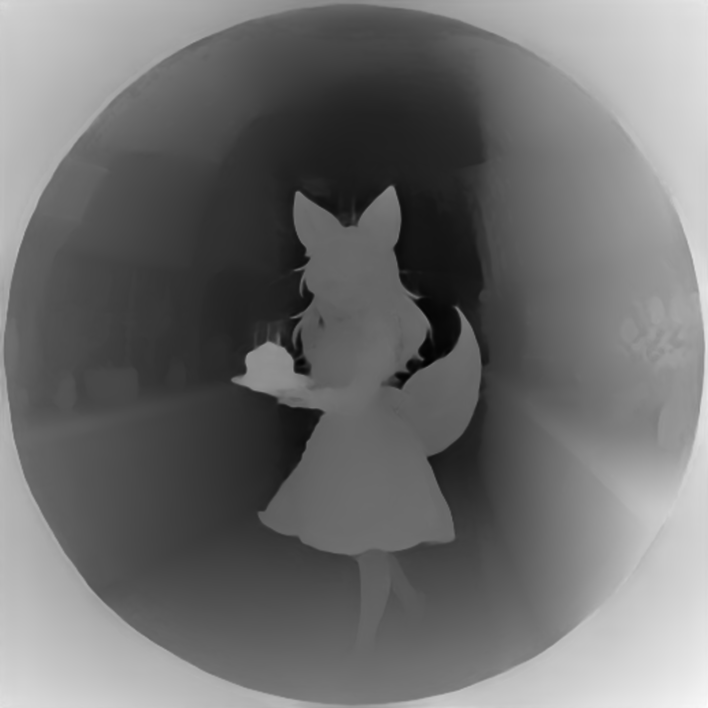

# camera-comfyUI
[](https://deepwiki.com/Alexankharin/camera-comfyUI)


> Custom ComfyUI nodes for advanced reprojections, point cloud processing, and camera-driven workflows.

---

## Table of Contents

* [Overview](#overview)
* [Features](#features)
* [Installation](#installation)
* [Node Categories](#node-categories)
* [Node Reference](#node-reference)
* [Video → 4D World](#video--4d-world)
* [Workflows](#workflows)
* [Example Workflows](#example-workflows)
* [Contributing](#contributing)
* [TODO List](#todo-list)

---

## Overview

A collection of ComfyUI custom nodes to handle diverse camera projections (pinhole, fisheye, equirectangular), depth‐to‐point cloud conversions, dynamic reprojections, and inpainting/outpainting pipelines. Use these nodes to craft complex VR and 3D‐aware image transformations with minimal setup.

## Features

* ⚡ **Continuous Reprojection**: Transform images and depth maps between projection models.
* 🌐 **Point Cloud Pipelines**: Convert depth to 3D, clean, transform, and reproject point clouds.
* 🎥 **Camera Motion & Outpainting**: Animate camera trajectories, perform text‐guided outpainting in arbitrary views.
* 📦 **Modular Nodes**: Groupable ComfyUI nodes for flexible graph composition.
* 🛠️ **Example Workflows**: Ready‐to‐use JSON workflows demonstrating reprojection, inpainting, and view synthesis.

## Installation

### Option A — ComfyUI Manager (recommended)

The node pack is published to the [ComfyUI Registry](https://registry.comfy.org) as **`camera-comfyui`** (publisher `alexk`). In ComfyUI, open **Manager → Custom Nodes Manager**, search for **camera-comfyUI**, and click **Install**, then restart ComfyUI.

Installation is fully automatic: ComfyUI-Manager installs `requirements.txt` and then runs this pack's `install.py`, which sets up everything the optional nodes need — no manual steps:

* **vggt** (`VideoPoseEstimator`) — pip-installed from GitHub over https (it is not on PyPI).
* **SHARP** (`ImageToSplat`, `VideoToFusedSplats`, …) — the `submodules/ml-sharpt` checkout is bundled in the registry package (and fetched via `git submodule`/clone for git installs), and its Python deps come from `requirements.txt`.
* **gsplat** — pip-installed; its CUDA kernels JIT-compile on first use.
* **ComfyUI-Flux-Inpainting** (`OutpaintAnyProjection`, `SplatTrajectoryEnricher`) — cloned automatically into `custom_nodes/inpainting_flux` (skipped if you already have the pack under any of its usual folder names).
* **Example inputs** — the sample image/trajectory files referenced by the bundled workflows are copied into ComfyUI's `input/` folder, so the templates run immediately.

Each step is optional and non-fatal: if one fails (e.g. no network), only the nodes that need it stay disabled — re-run `python install.py` inside the pack folder to retry.

> **Maintainers:** releases are automated — bumping `version` in `pyproject.toml` on `main` triggers `.github/workflows/publish_action.yml`, which publishes the new version to the registry (requires the `REGISTRY_ACCESS_TOKEN` repo secret).

### Option B — Manual install (git)

1. **Clone** into your ComfyUI custom nodes folder:

   ```bash
   git clone https://github.com/Alexankharin/camera-comfyUI.git custom_nodes/camera-comfyUI
   ```

2. **System Dependencies (Ubuntu)**:

   ```bash
   sudo apt-get update && sudo apt-get install build-essential ffmpeg libsm6 libxext6 -y
   ```

3. **Python Requirements + optional dependencies** — one command sets up everything (base requirements, vggt, the SHARP submodule, gsplat, and the `inpainting_flux` sibling pack):

   ```bash
   cd custom_nodes/camera-comfyUI && python install.py
   ```

   This is the same script ComfyUI-Manager runs automatically; it is idempotent, and every optional step is non-fatal.

   **What it covers** (for reference — no manual action needed):

   * **gsplat** — CUDA-accelerated Gaussian splat rasterizer. Required by `SplatPolish`, SHARP, and the fast render backend for `RenderSplat` / `RenderSplats4D*`. Kernels JIT-compile on first use (needs a CUDA GPU + matching PyTorch build).
   * **vggt** — camera pose + depth estimation (`VideoPoseEstimator`). Not on PyPI — installed with `pip install git+https://github.com/facebookresearch/vggt.git`. A sibling clone of [facebookresearch/vggt](https://github.com/facebookresearch/vggt) in your ComfyUI root also works. The `facebook/VGGT-1B` weights (~5 GB) download via `huggingface_hub` on first use.
   * **CoTracker3** — point tracking for `EstimateTracks`. Fetched automatically via `torch.hub` on first use.
   * **SHARP** — image→splat prediction (`ImageToSplat`, `FisheyeToGaussian`, `VideoToFusedSplats`, `SplatTrajectoryEnricher`). Lives as the git submodule at `submodules/ml-sharpt` ([apple/ml-sharp](https://github.com/apple/ml-sharp)); `install.py` initializes it for you.
   * **ComfyUI-Flux-Inpainting** — cloned into `custom_nodes/inpainting_flux` if missing. Any of the usual folder names (`inpainting_flux`, `ComfyUI-Flux-Inpainting`, `ComfyUI-Flux-Inpainting-main`) is detected — no renaming needed.

4. **Additional Nodes** (only for some example workflows):

   * [ComfyUI-Image-Filters](https://github.com/spacepxl/ComfyUI-Image-Filters) — install via Manager or clone into `custom_nodes`.

5. **Flux Models** (Hugging Face, only for gated models):

   ```bash
   huggingface-cli login
   ```

6. Restart ComfyUI to load new nodes.

---

## Node Categories

* ### Reprojection Nodes

  * `ReprojectImage`, `ReprojectDepth`, `OutpaintAnyProjection`

* ### Matrix Nodes

  * `TransformToMatrix`, `TransformToMatrixManual`

* ### Depth Nodes

  * `DepthEstimatorNode`, `DepthToImageNode`, `ZDepthToRayDepthNode`
  * `CombineDepthsNode`, `DepthRenormalizer`, `FisheyeDepthEstimator`

* ### Point Cloud Nodes

  * `DepthToPointCloud`, `TransformPointCloud`, `ProjectPointCloud`, `PointCloudUnion`
  * `PointCloudCleaner`, `LoadPointCloud`, `SavePointCloud`, `ProjectAndClean`, `DepthEdgeFilter`

* ### Trajectory Nodes

  * `CameraMotionNode`, `CameraInterpolationNode`, `CameraTrajectoryNode`
  * `SaveTrajectory`, `LoadTrajectory`, `PointcloudTrajectoryEnricher`

* ### Gaussian Splat Nodes

  * `LoadPlySplat`, `SavePlySplat`, `ImageToSplat`, `FisheyeToGaussian`
  * `RotateSplats`, `MergeSplats`, `FuseSplats`, `RenderSplat`
  * `VideoToFusedSplats`, `SplatPolish`

* ### 4D Gaussian Splat Nodes

  * `MotionMaskFromDepth`, `EstimateTracks`, `TracksToTrajectories`, `SplitSplatsByMask`
  * `BuildSplats4D`, `RenderSplats4DFrame`, `RenderSplats4DVideo`
  * `SaveSplats4D`, `LoadSplats4D`

* ### Pose Nodes

  * `VideoPoseEstimator`, `TrajectoryInvert`, `TrajectoryCompose`

* ### World Nodes

  * `DepthScaleAnchor`, `SplatTrajectoryEnricher`, `SphereSplatSeed`

---

## Node Reference

*(See inline tooltips in ComfyUI for parameter details.)*

| Node                      | Description                                                                   |
| ------------------------- | ----------------------------------------------------------------------------- |
| `ReprojectImage`          | Reproject image between projection types (Pinhole, Fisheye, Equirectangular). |
| `ReprojectDepth`          | Same as above but for depth maps.                                             |
| `OutpaintAnyProjection`   | Extracts a patch in any view, outpaints (Flux), reprojects back.              |
| `DepthEstimatorNode`      | Runs HF Depth‐Anything-v2 models to produce metric depth.                     |
| `DepthToPointCloud`       | Converts Depth and image to → 3D point cloud tensor (N×7).                    |
| `DepthToImageNode`        | Converts depth to image (N×3) using a color map.                              |
| `ZDepthToRayDepthNode`    | Converts Z-depth (output of metric-depth-anything) to ray depth to compensate lens curvature.                        |
| `TransformPointCloud`     | Applies 4×4 rotation matrix to point cloud.                                   |
| `ProjectPointCloud`       | Z-buffer–based projection of point cloud into image + mask.                   |
| `PointCloudCleaner`       | Removes isolated points via voxel filtering.                                  |
| `PointCloudUnion`         | Combines multiple point clouds into one.                                      |
| `LoadPointCloud`          | Loads a point cloud from `.npy` or `.ply` format.                             |
| `SavePointCloud`          | Saves a point cloud to `.npy` or `.ply` format.                               |
| `CameraMotionNode`        | Generates image and mask sequences along a camera trajectory with optional mask dilation/inversion. |
| `CameraInterpolationNode` | Builds a trajectory tensor from two poses.                                    |
| `CameraTrajectoryNode`    | Interactive Open3D GUI for recording camera waypoints.                        |
| `SaveTrajectory`          | Saves a trajectory tensor to a file.                                          |
| `LoadTrajectory`          | Loads a trajectory tensor from a file.                                        |
| `VideoCameraMotionSequence` | Processes video frames and depth maps along a camera trajectory, generating reprojected outputs. |
| `DepthFramesToVideo`      | Converts a sequence of depth maps into video frame tensors for saving.        |
| `VideoMetricDepthEstimate` | Estimates metric depth for a sequence of frames using VideoDepthAnything.    |
| `DepthEdgeFilter`         | Detects "flying pixel" depth discontinuities and outputs a validity mask (1.0 = valid). |
| `LoadPlySplat`            | Loads a 3D Gaussian Splatting `.ply` file into a `GSPLAT` object.             |
| `SavePlySplat`            | Saves a `GSPLAT` to the ComfyUI output directory as a `.ply` file.            |
| `ImageToSplat`            | Predicts Gaussian splats from a single image using SHARP.                     |
| `FisheyeToGaussian`       | Reprojects a fisheye view to multiple pinhole angles, predicts splats, rotates and merges them. |
| `RotateSplats`            | Applies a 4×4 transform matrix to a splat cloud.                              |
| `MergeSplats`             | Concatenates two `GSPLAT` objects into one.                                   |
| `FuseSplats`              | Fuses two splat clouds with weighted voxel merging (keep/discard/average/smart modes). |
| `RenderSplat`             | Renders a splat cloud from a camera pose into an image + mask.                |
| `VideoToFusedSplats`      | Runs SHARP on video keyframes, scale-aligns to metric depth, filters dynamic pixels, and fuses all keyframes into one world-frame splat cloud. |
| `SplatPolish`             | Optimizes a world-frame splat cloud against posed video frames (L1 + D-SSIM) using gsplat's differentiable rasterizer. |
| `MotionMaskFromDepth`     | Detects dynamic pixels from a depth+pose sequence (1.0 = moving).             |
| `EstimateTracks`          | Runs CoTracker3 on a video; returns tracks `[T,N,2]` (pixels) and visibility `[T,N]`. |
| `TracksToTrajectories`    | Unprojects 2D tracks with depth and camera poses into world-space 3D trajectories `[T,M,3]`. |
| `SplitSplatsByMask`       | Projects splat centers into a 2D mask and splits the cloud into inside/outside parts. |
| `BuildSplats4D`           | Builds a 4D splat scene: each canonical splat follows a kNN blend of track control-point motions. |
| `RenderSplats4DFrame`     | Evaluates the 4D scene at a single time value and renders it from a given camera. |
| `RenderSplats4DVideo`     | Interpolates the camera path, sweeps time from start to end, and renders each frame. |
| `SaveSplats4D`            | Saves a `GSPLAT4D` scene as an `.npz` archive (plus optional per-frame PLYs). |
| `LoadSplats4D`            | Loads a `GSPLAT4D` scene from an `.npz` archive.                              |
| `VideoPoseEstimator`      | VGGT-based per-frame camera poses `[T,4,4]`, depth maps, FOV and depth confidence from a video clip. |
| `TrajectoryInvert`        | Inverts each 4×4 pose (world-to-camera ↔ camera-to-world).                   |
| `TrajectoryCompose`       | Per-frame matrix product `A @ B`; a single 4×4 input broadcasts over the other. |
| `DepthScaleAnchor`        | Robustly aligns a depth map to a reference depth via disparity-domain scale(+shift). |
| `SplatTrajectoryEnricher` | Expands a splat world along a trajectory: render, outpaint holes with Flux, lift with SHARP, scale-align, smart-stitch. |
| `SphereSplatSeed`         | Converts an equirectangular panorama into a Gaussian sphere seeding a 360° world. |

---

## Video → 4D World

Turn a monocular video into a navigable 4D (3D + time) Gaussian splat scene and re-render it from any novel camera trajectory. The reference workflow is **`workflows/video_to_4d_world.json`**; the stages are:

1. **Pose & depth (VGGT)** — `VideoPoseEstimator` estimates per-frame world-to-camera poses `[T,4,4]`, depth maps, FOV and depth confidence from the input frames. Since the depth maps are Z-depths, run `ZDepthToRayDepthNode` before any node that expects ray depth (see caveats below). `DepthEdgeFilter` can additionally mask out flying pixels at depth discontinuities.
2. **Motion masking** — `MotionMaskFromDepth` warps depth between frames using the estimated poses and flags pixels whose residual is too large as dynamic (moving objects vs. static background).
3. **Static splat fusion + polish** — `VideoToFusedSplats` runs SHARP on keyframes, keeps only static pixels (via the motion mask), scale-aligns each keyframe to metric depth, transforms splats into the world frame and fuses them incrementally. `SplatPolish` then fine-tunes the fused cloud photometrically against the posed video frames.
4. **Tracked dynamic 4D Gaussians** — `EstimateTracks` (CoTracker3) tracks a dense point grid across the video; `TracksToTrajectories` lifts the tracks to world-space 3D using depth + poses; `SplitSplatsByMask` separates dynamic splats from the static background; `BuildSplats4D` binds the dynamic canonical splats to track control points via kNN blending, producing a `GSPLAT4D` scene.
5. **Render a novel trajectory** — build any new camera path (e.g. `CameraInterpolationNode`, `TrajectoryCompose` to retarget relative to a source pose) and render with `RenderSplats4DVideo` (or single frames with `RenderSplats4DFrame`). Save/reload scenes with `SaveSplats4D` / `LoadSplats4D`.

### Caveats

* **Z-depth vs ray depth**: depth estimators (including `VideoPoseEstimator`) output Z-depth; point-cloud and splat lifting nodes expect ray depth. Insert `ZDepthToRayDepthNode` where needed, or geometry will bow at wide FOVs.
* **`SplatPolish` requires gsplat + CUDA**: without them it can fall back to the differentiable torch renderer at reduced resolution, which is extremely slow (minutes per 100 iterations).
* **`EstimateTracks` downloads CoTracker3 via `torch.hub` on first use** — expect a one-time download and allow network access.
* **`VideoPoseEstimator` downloads `facebook/VGGT-1B` (~5 GB)** on first use via `huggingface_hub`.

---

## Workflows

A set of JSON workflows illustrating typical use cases. Once the pack is installed they appear in ComfyUI under **Workflow → Browse Templates** (with thumbnails); the files live in `workflows/` and can also be loaded directly. Each workflow contains an embedded **“About this workflow”** note in the canvas explaining its stages, what to set, and what it needs — and references the bundled example inputs that `install.py` copies into your ComfyUI `input/` folder, so they run as-is on a fresh install.

*Extras* below means dependencies beyond this pack and Depth-Anything V2 (which auto-downloads); `inpainting_flux` is installed automatically by `install.py`.

| Workflow | Description | Extras |
| --- | --- | --- |
| **demo\_camera\_workflow\.json** | Minimal demo: rotate the camera and reproject pinhole → equirectangular, with coverage mask | — |
| **Outpaint\_node\_test.json** | One-patch smoke test of `OutpaintAnyProjection` | inpainting_flux |
| **Outpaint\_fisheye180.json** | Pinhole 90° → full 180° fisheye via five chained `OutpaintAnyProjection` passes + composite/upscale | inpainting_flux |
| **outpainting\_fisheye\_flux.json** | Manual version of the above: explicit Flux Inpainting + reprojection stages | inpainting_flux, RealESRGAN |
| **fisheye\_to\_pointcloud.json** | Fisheye 180° → metric depth → point cloud (`.ply`/`.npy`) | — |
| **PointCloud.json** | Single image → point cloud → cleaned novel-view render | Image-Filters (optional) |
| **pointcloud\_walker.json** | Image → point cloud → camera fly-through WEBM | — |
| **test\_pointcloud\_loading.json** | Reload a saved point cloud and orbit-render it | — |
| **record\_trajectory.json** | Record a camera trajectory `.npy` for LoadTrajectory (two poses → SE(3) interpolation → SaveTrajectory) | — |
| **pointcloud\_inpaint.json** | Enrich a cloud: Flux-inpaint disocclusions, lift them to 3D, merge, orbit render | inpainting_flux |
| **PC\_enricher.json** | One-node version of the above: `PointcloudTrajectoryEnricher` along a saved trajectory | inpainting_flux |
| **sbs180\_workflow.json** | Synthesize the second eye of a VR180 stereo pair from one fisheye view | inpainting_flux |
| **video\_camera.json** | Re-shoot a video with a new camera move; WAN VACE regenerates disocclusions, Florence2 auto-captions | VHS, Florence2; WAN 2.1 VACE + Video-Depth-Anything models |
| **wan\_vace\_ref\_to\_video.json** | Still fisheye image + recorded trajectory → WAN VACE camera-move video | WAN 2.1 VACE models; VHS (optional MP4 export) |
| **video_to_4d_world\.json**            | Video → 4D world: VGGT poses/depth → motion masking → fused static splats + polish → tracked dynamic 4D Gaussians → novel-trajectory render. | — |
| **video_to_4d_walkable_world\.json**   | Video → 4D WALKABLE world (test-friendly defaults): polished static splats enriched along a walk trajectory (`SplatTrajectoryEnricher`, Flux outpaint + SHARP) → 4D scene → walk-through render + `.ply`/`.npz` exports for free walking in external 3DGS viewers. | inpainting_flux |

Superseded reference graphs live in `workflows/legacy/` (kept out of the template browser): **outpainting\_fisheye.json** (SD-inpaint-checkpoint variant of the flux outpaint) and **Fisheye\_depth\_workflow\.json** (the multi-view depth fusion that `FisheyeDepthEstimator` now performs internally).

---

## Example Workflows

### 1. `demo_camera_workflow.json`

Basic reprojection pipeline: apply masks, rotate pinhole camera, outpaint fisheye, move point cloud, reproject.

<div style="display:flex; gap:10px;">
  
  
</div>

### 2. `legacy/outpainting_fisheye.json`

Simplest text‐guided fisheye outpainting built with the core inpaint node (superseded by the Flux variant).

### 3. `outpainting_fisheye_flux.json`

Flux Inpainting ensures sharper results and explicit reprojection stages.

<div style="display:flex; gap:10px;">
  
</div>

### 4. `Outpaint_fisheye180.json`

180° fisheye outpainting via the universal `OutpaintAnyProjection` node.


### 5. `legacy/Fisheye_depth_workflow.json`

Convert fisheye images to metric depth and generate a PLY point cloud — the manual multi-view graph that `FisheyeDepthEstimator` now performs in one node (see `fisheye_to_pointcloud.json`).



### 6. `Outpaint_node_test.json`


Quick test for the universal outpaint node in arbitrary views and camera movement

### 7. `PointCloud.json`

Depth→PointCloud pipeline with interactive camera movement and reprojection views.


### 8. `pointcloud_inpaint.json`

Inpaint image with shifted camera and backproject for dynamic camera‐driven video outputs.


### 9. `sbs180_workflow.json`

Take a wide-angle (fisheye or equirectangular) high-resolution (e.g., 4096×4096) image and generate a stereo pair by moving the camera horizontally. The output is a wide-angle stereo pair (side-by-side), simulating a fisheye or equirectangular stereo camera.


### 10. `pointcloud_walker.json`

Image → point cloud → camera fly-through rendered to WEBM (`CameraTrajectoryNode` + `CameraMotionNode`).

### 11. `video_camera.json`

This workflow demonstrates camera trajectory movement using the `wan-vace` video inpainting model. It generates smooth camera movements along a trajectory while filling missing regions with high-quality inpainting.

<div style="display:flex; gap:10px;">
  
</div>

---

## Trajectory Concept

A **trajectory** in camera-comfyUI is a sequence of camera poses, each represented as a 4×4 transformation matrix. This set of matrices defines the path and orientation of the camera through 3D space, enabling smooth and complex camera movements for view synthesis, point cloud rendering, and video generation.

### Creating Trajectories

There are two main ways to create a trajectory:

- **Camera Matrices Interpolation:**  
  Define two or more camera poses (as matrices), and interpolate between them to generate a smooth path. The `CameraInterpolationNode` automates this process, producing a trajectory tensor for use in camera motion nodes.

- **Walking in Open3D Environment:**  
  Use the interactive Open3D GUI (`CameraTrajectoryNode`) to "walk" through the point cloud. As you move the camera, waypoints (poses) are recorded, forming a trajectory that can be exported and reused.

### Using Trajectories

The `CameraMotionNode` takes a trajectory (set of matrices) and interpolates camera positions and orientations along it, producing smooth camera movements for rendering sequences or videos.

---

## Point Cloud Formats

Point clouds can be saved and loaded in two formats:

- **.npy**: Numpy array format (fast, preserves all tensor data, recommended for internal pipelines).
- **.ply**: Polygon File Format (widely supported, viewable in external 3D tools).

Use the `SavePointCloud` and `LoadPointCloud` nodes to handle I/O operations in either format.

---

## Contributing

Contributions welcome! Please open issues or PRs to add features, improve docs, or refine workflows.

## TODO List

* [x] Add processing to pointcloud or depthmap to remove outlier and lonely points at depth borders.
* [x] Use built-in comfyUI mask type an image.
* [x] Unite nodes into groups to simplify workflows.
* [x] Create a single workflow for view synthesis (`video_to_4d_world.json`).
* [x] Implement easier and more flexible camera control - more complex camera movements with more than 2 points.
* [x] Add more examples and documentation for each node.
* [x] Add pointcloud union
* [x] Fix imports for renamed folders (e.g., inpainting_flux)
* [x] Integrate camera movement pipeline with video models (e.g., wan2.1) for smooth, high-quality inpainting along camera trajectories.
* [ ] Compressed export format for 4D scenes (current `.npz` stores raw tensors).
* [ ] SAM2-based refinement of motion masks (current masks come from depth-warp residuals only).
* [ ] Fisheye/equirectangular rendering through gsplat (e.g., via cubemap render + reprojection); the fast CUDA path is currently pinhole-only.
