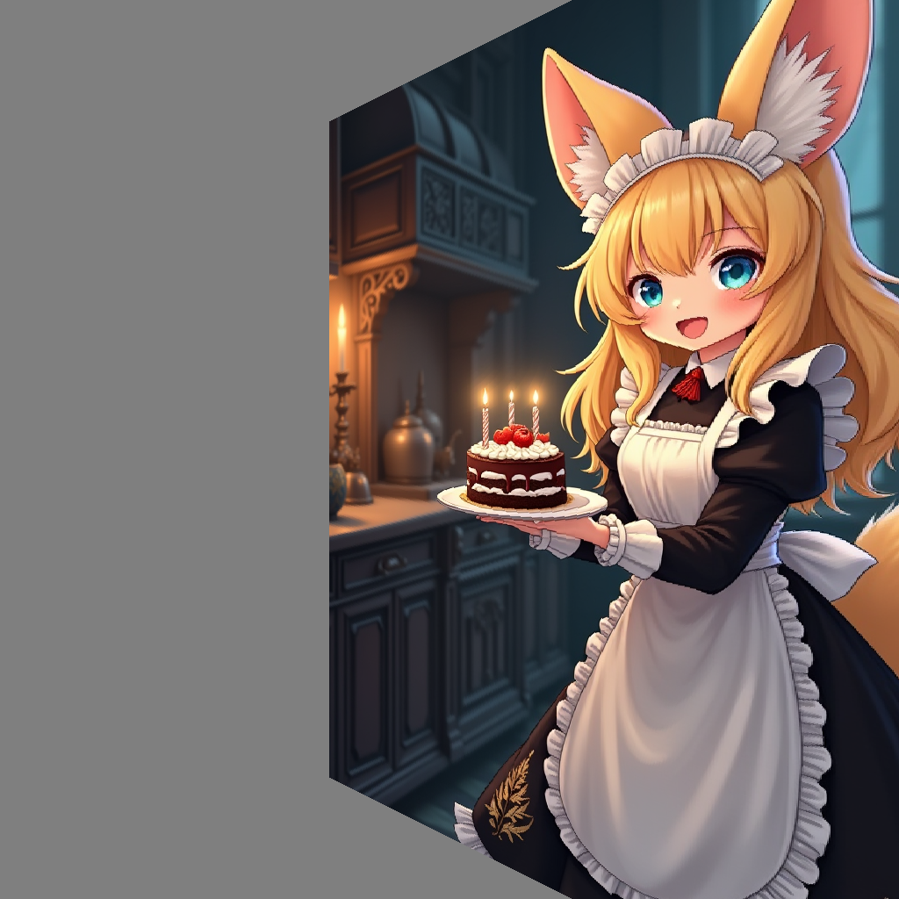

# camera-comfyUI

## Overview
This repository contains custom nodes for ComfyUI, designed to handle various projection models, camera movements, and point cloud manipulations. These nodes can be used to enhance workflows, create dynamic visual outputs, and perform continuous reprojection tasks.

## Features
- **Reprojection Nodes**: Enable continuous reprojection between different camera models and projections.
- **Point Cloud Nodes**: Work with point clouds, including depth-to-point cloud conversion, transformations, and rendering.
- Support for multiple projection models: Pinhole, Fisheye, and Equirectangular.
- Customizable camera movement and transformation nodes.
- Example workflows to demonstrate functionality.

## Installation

1. **Clone the repository**
   
   Place this repository in your ComfyUI `custom_nodes` directory:
   ```bash
   git clone https://github.com/your-repo/camera-comfyUI.git custom_nodes/camera-comfyUI
   ```

2. **Install system dependencies (Linux/Ubuntu only)**
   
   If you are on Ubuntu, you may need to install some system packages for full functionality:
   ```bash
   sudo apt-get update && sudo apt-get install build-essential ffmpeg libsm6 libxext6 -y
   ```

3. **Install Python dependencies**
   
   Make sure you are using Python 3.12.x (the version used by ComfyUI). Then install the required packages:
   ```bash
   pip install -r custom_nodes/camera-comfyUI/requirements.txt
   ```
   - `open3d` is optional and only needed for point cloud visualization.

4. **Install additional required nodes**
   
   Some workflows require extra custom nodes for full functionality:
   - [ComfyUI-Flux-Inpainting](https://github.com/rubi-du/ComfyUI-Flux-Inpainting) (required for flux-based inpainting)
   - [ComfyUI-Image-Filters](https://github.com/spacepxl/ComfyUI-Image-Filters) (for image processing and morphology operations)
   - [Other custom nodes as needed for your workflow]

5. **Flux-based inpainting setup**
   
   Outpainting/inpainting nodes use Flux Inpainting for best results. You must log in to HuggingFace to access the required models:
   ```bash
   pip install huggingface_hub
   huggingface-cli login
   ```
   Enter your HuggingFace token when prompted.

6. **Restart ComfyUI**
   
   After installation, restart ComfyUI to load the new nodes.

7. **Example workflows**
   
   Example workflows are provided in the `workflows/` folder. See the README for details.

## Node Categories

### Reprojection Nodes
These nodes allow for continuous reprojection between different camera models and projections. They include:
- **ReprojectImage**: Reprojects an image from one projection type to another.
- **TransformToMatrix**: Converts translation and rotation parameters into a 4x4 transformation matrix.
- **TransformToMatrixManual**: Allows manual input of a 4x4 transformation matrix.

### Point Cloud Nodes
These nodes enable working with point clouds and depth maps. They include:
- **DepthToPointCloud**: Converts a depth map and optional RGB(A) image into a point cloud.
- **TransformPointCloud**: Applies a 4x4 transformation matrix to a point cloud.
- **ProjectPointCloud**: Projects a point cloud back into an image and mask using z-buffering.

## Node Reference

### Matrix Transformation Nodes

- **TransformToMatrix**: Generates a 4x4 transformation matrix from translation (shiftX, shiftY, shiftZ) and rotation (theta, phi) parameters. Used for camera movement and reprojection.
- **TransformToMatrixManual**: Allows manual entry of all 16 elements of a 4x4 transformation matrix for advanced camera or point cloud transformations.

### Reprojection-Related Nodes

- **ReprojectImage**: Reprojects an image from one camera model/projection (Pinhole, Fisheye, Equirectangular) to another, with support for field of view, rotation, and optional masking.
- **ReprojectDepth**: Reprojects a depth map between different camera models and projections, similar to ReprojectImage but for depth data.
- **OutpaintAnyProjection**: Extracts a patch from an image in any projection, performs outpainting (optionally using Flux Inpainting), and reprojects the result back. Useful for filling missing regions in arbitrary camera views.

### Depth-Related Nodes

- **DepthEstimatorNode**: Runs depth estimation using HuggingFace Depth-Anything models, producing a metric depth tensor from an input image.
- **DepthToImageNode**: Converts a single-channel depth tensor into a normalized grayscale image for visualization, with optional inversion.
- **ZDepthToRayDepthNode**: Converts a z-buffer depth map to a ray-depth map, accounting for camera intrinsics (pinhole model, horizontal FOV).
- **CombineDepthsNode**: Combines two depth maps and their masks using various modes (average, overlay, soft merge), returning a blended depth and mask.
- **DepthRenormalizer**: Adjusts a depth tensor to match another (guidance) depth in non-masked regions, optionally in inverse-depth space.

### Pointcloud-Related Nodes

- **DepthToPointCloud**: Converts a depth map (and optional RGB(A) image and mask) into a point cloud tensor (N,7: X, Y, Z, R, G, B, A), supporting multiple projections.
- **TransformPointCloud**: Applies a 4x4 transformation matrix to a point cloud, enabling camera movement or alignment.
- **ProjectPointCloud**: Projects a point cloud back into an image and mask using z-buffering, with adjustable point size and support for different projections.
- **PointCloudUnion**: Merges two point clouds into one, concatenating their points.
- **LoadPointCloud**: Loads a PLY point cloud file from the ComfyUI input directory into a tensor.
- **SavePointCloud**: Saves a point cloud tensor to a PLY file in the ComfyUI output directory, with customizable filename prefix.
- **CameraMotionNode**: Renders a sequence of images by interpolating camera poses along a trajectory and projecting the point cloud for each pose.
- **CameraInterpolationNode**: Creates a trajectory tensor from two 4x4 camera poses, for use in camera animation or interpolation.
- **CameraTrajectoryNode**: Interactive tool to select and record multiple camera poses in a point cloud, outputting a trajectory tensor for animation.
- **PointCloudCleaner**: Removes outlier or isolated points from a point cloud by voxelizing and filtering based on minimum points per voxel.

## Usage
1. **Reprojection Nodes**:
   - Use the `ReprojectImage` node to reproject images between different camera models and projections.
   - Use the `TransformToMatrix` or `TransformToMatrixManual` nodes to create transformation matrices for reprojection.
  

2. **Point Cloud Nodes**:
   - Use the `DepthToPointCloud` node to convert depth maps into point clouds.
   - Apply transformations to point clouds using the `TransformPointCloud` node.
   - Render point clouds back into images using the `ProjectPointCloud` node.
  
 - Outpainting reprojection for both piintcloud and grid_sampled nodes may be done by standard built-in inpaint/outpaint workflow or using the [ComfyUI-Flux-Inpainting](https://github.com/rubi-du/ComfyUI-Flux-Inpainting) for better results.

## Example Workflows
Example workflows are provided in the `workflows/` folder to help you get started:

### `demo_camera_workflow.json`
Demonstrates camera movement and reprojection. This workflow showcases how to outpaint an image in both pinhole and fisheye projections while rotating the camera. Example image pairs:

- **Initial Image - Pinhole Rotated**:
<div style="display: flex;">
  
  
</div>

- **Initial Image - Inpainted Fisheye**:
<div style="display: flex;">
  
  
</div>

- **Initial Image - Pointcloud Moved**:
<div style="display: flex;">
  
  
</div>

- **Initial Image - Pointcloud Fisheye Inpainted**:
<div style="display: flex;">
  
  
</div>

### `outpainting_fisheye.json` and `outpainting_fisheye_kitchen.json`
Showcases fisheye outpainting workflows. Example images:
<div style="display: flex;">
  
  
</div>

### `PointCloud.json`
Demonstrates point cloud manipulation and rendering. If depth is used, it is possible to move the camera freely and generate unpainted and outpainted images via point cloud.

### `Test pointcloud_loading.json`
This workflow demonstrates rendering camera movement from a point cloud. It showcases how to interpolate camera positions and generate dynamic visualizations. Example animation:

<div style="display: flex;">
  
</div>

The whole workflow for view synthesis is combination of `pointcloud_inpaint.json` and `Pointcloud_enricher.json` . 

## Additional Requirements
Some workflows require additional nodes from the following repositories:
- [ComfyUI-Flux-Inpainting](https://github.com/rubi-du/ComfyUI-Flux-Inpainting)
- [ComfyUI-Image-Filters](https://github.com/spacepxl/ComfyUI-Image-Filters) (for CV and morphology operations)


## Contributing
Feel free to submit issues or pull requests to improve this repository. Contributions are welcome!

## TODO List
- [ ] Add processing to pointcloud or depthmap to remove outlier and lonely points at depth borders.
- [x] Use built-in comfyUI mask type an image.
- [x] Unite nodes into groups to simplify workflows.
- [ ] Create a single workflow for view synthesis.
- [x] Implement easier and more flexible camera control - more complex camera movements with more than 2 points.
- [ ] Add more examples and documentation for each node.
- [x] Add pointcloud union